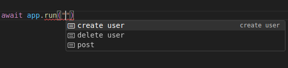
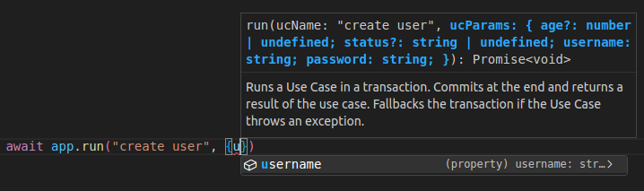

# DDDam-App - Easy and strongly typed mediator for Application layer

The **Clean Architecture** can be very cool while you implement your domain layer.
Your code is pretty, your business logic is **Clear**, your dependencies are amazingly abstract.
You even learn about Domain Events and fascinated to make some. Everything is perfect.

Then you go on to implement the Application layer. You start making your Use Cases
and find yourself quite puzzled. You need to implement
transactions, event dispatching, loading of dependencies, loading of dependencies with transactions...
You understand that you would be very happy if all of that was implemented by someone else.
After all, its just technical nuances that distract you from real business values of your project.

Once upon a time a hard-working beaver named Bobr faced the same problems and made a solution
that you could find suitable for your needs. Let's see.

## Use Cases

We will start from Use Cases.
The type of the DUseCase is quite tricky but you only need to know about three constructor parameters. Let's see an example:

```typescript
const createUserUC = new DUseCase(
    "create user",
    Type.Object({
        username: Type.String(),
        password: Type.String(),
        email: Type.String(),
        age: Type.Optional(Type.Number()),
        status: Type.Optional(Type.String()),
    }),
    async(params, deps: Dependencies, handleDEvent) => {
        console.log("create user...");
        const user = new User(
            params.username,
            deps.passwordService.hashPassword(params.password),
            params.age ?? null,
            params.status ?? null,
        );
        deps.userRepo.add(user);
        handleDEvent([new UserAdded(params.username)]);
    }
);
```

The first parameter is the name of the Use Case. It will be remembered by Typescript
and will help us in the future.

The second one is the validator of the Use Case parameters from [Typebox](https://github.com/sinclairzx81/typebox) library.
This is my decision for an old dilemma about DTOs:
if you declare them in the Application layer you lose its support
by features of the Presentation layer frameworks like JSON validation,
if you declare them in the Presentation layer you can't use them in Application layer
because the Application layer can't depend on the Presentation layer.
So I decided to use Typebox: it's simple, statically typed and easily converted to JSON Schema
which is quite common and could be used by many Presentation layer frameworks,
so this third-party library shouldn't corrupt our Application layer.

The third parameter is the Use Case function itself. It takes three parameters:
- The Use Case parameters which has static type from the Typebox schema.
- Then the Use Case dependencies - the explicit type, as you see, is required here,
because the Use Case can't know what you want.
- The last one is eventHandler function. If you have events just give them to this handler.

## Events

Now let's see how events look. The basic type of events in DDDam-App is:
```typescript
interface DEvent<DEName extends string> {
    eventName: DEName;
}
```

To implement your Event you only need to write something like:

```typescript
class UserAdded {
    eventName = "USER ADDED" as const;

    constructor(
        readonly username: string,
        readonly email: string,
    ) {
        this.username = username;
        this.email = email;
    }
}
```
You can easily declare your Events in the Domain layer any way you wish,
you don't even need to bring the `DEvent` there because it's only an interface and Typescript is structurally typed.
But I beg you, don't forget about `as const` for `eventName`.

## Event Processors
An Event will be given to corresponding Event Processors. For example:

```typescript
const sendConfirmationEmailEP = new DEventProcessor(
    "USER ADDED",
    async(dEvent: UserAdded, deps: EventDependencies) => {
        const confirmationCode = deps.confirmation.createConfirmationCode(dEvent.username);
        deps.sendEmail(dEvent.email, `Your confirmation code: ${confirmationCode}`);
    }
);
```

`DEventProcessor` takes two parameters:

The first one is the Event name. The only reason this parameter exists is because
typescript can't "leak" an information from the compile-time to the runtime.
The name is already known from `dEvent: UserAdded` parameter but Typescript can't help us,
so we must write it ourselves. But Typescript can check that
the name in the first parameter matches the name in Event type (like `dEvent: UserAdded`),
and will inform us if we make any typo. That's why `as const` for `eventName` was important.

The second one is the processing function itself. The function takes two parameters:
the Event and `EventProcessor` dependencies. You must write types for both.

## Mediator

And now let's combine everything!

To do it we need a simple `DApp` instance. Maybe even not one if your needs demand that.

```typescript
const app = new DApp(
    getTransactionHandler(),
    [createUserUC, deleteUserUC, postUC],
    [sendConfirmationEmailEP,
     takeDiskSpaceEP,
     emailModeratorForSuspectedPostEP,
     freeDiskSpaceEP],
);
```

`DApp` constructor takes three parameters.

The first one is a Transaction Handler. We'll speak about it later.

The second one is an array of all Use Cases we have. Their Dependencies types most match.

The third one is an array of all our Event Processors. Their Dependencies types most match too,
but can be different from those of Use Cases.

And let's see the magic!!!

To run a Use Case we need to call `app.run` method. And it has a LOT of type magic.



As you see, Typescript made IDE suggest Use Case names so we won't make a mistake.
And it will inform if you write a wrong name.

Then we write Use Case parameters:



Typescript surprizes us again and makes IDE suggest the type of the parameters.
But the parameters will be validated by anyway so you can pass any not validated data.

Then the Use Case and Events will just work.  


DDDam-App takes your Use Cases and its Events then runs them by your order -
each Use Case and its Events in a transaction with your dependencies loaded as you want.
You must implement your own transaction handler but the convention of the library is
that if everything is OK transaction is committed, if an exception is thrown transaction rollbacks.
